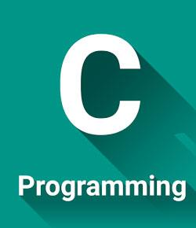

## C Programming Language


### Purpose:

Example of using C on the Harvard University FAS cluster. The specific
example compute the integer sum from 1 to N, where N is a number read
from the command line.

### Contents:

* <code>sum.c</code>: C source code
* <code>run.sbatch</code>: Example batch-job submission script
* <code>c_test_job.out</code>: STD output file

### Compile:

Request a compute node on the `test` partition, e.g.:
```bash
salloc -p test --nodes=1 --cpus-per-task=2 --mem=4GB --time=0-01:00:00
```

Compile the code. In this example, we will use the GNU compiler, e.g:
```bash
module load gcc/9.5.0-fasrc01
gcc -O2 -o sum.x sum.c
```

### C source code:

```c
//====================================================================
// Program: sum.c
//          Computes integer sum from 1 to N where N is an integer
//          read from the command line
//
// Compile: gcc -O2 -o sum.x sum.c
//
// Usage:   ./sum.x N
//====================================================================
#include <stdio.h>
#include <stdlib.h>

// Main program.......................................................
int main(int argc, char *argv[] ){
  int i;
  int j;
  int n;
  n = atoi( argv[1] );
  printf("%s %d \n", "Welcome! This program prints out the sum of 1 to", n);
  j = 0;
  for ( i = 1; i <= n; i++ ){
    j = j + i;
  }
  printf("%s %d %s %d \n", "Sum of 1 to", n, "is", j);
  printf("%s \n", "End of program.");
  return 0;
}
```

### Example batch-job submission script:

In this example, we will use the same GNU compiler version used at the
time of compilation for launching our production run.


```bash
#!/usr/bin/env bash
#SBATCH -J c_test_job
#SBATCH -o c_test_job.out
#SBATCH -e c_test_job.err
#SBATCH -p shared
#SBATCH -N 1
#SBATCH -c 1
#SBATCH -t 0-00:30
#SBATCH --mem=2G

# Load required software modules
module load gcc/9.5.0-fasrc01

# Run program
./sum.x 100
```

### Submit job:

```bash
sbatch run.sbatch
```

### Example output:

```
$ cat c_test_job.out
Welcome! This program prints out the sum of 1 to 100 
Sum of 1 to 100 is 5050 
End of program. 
```