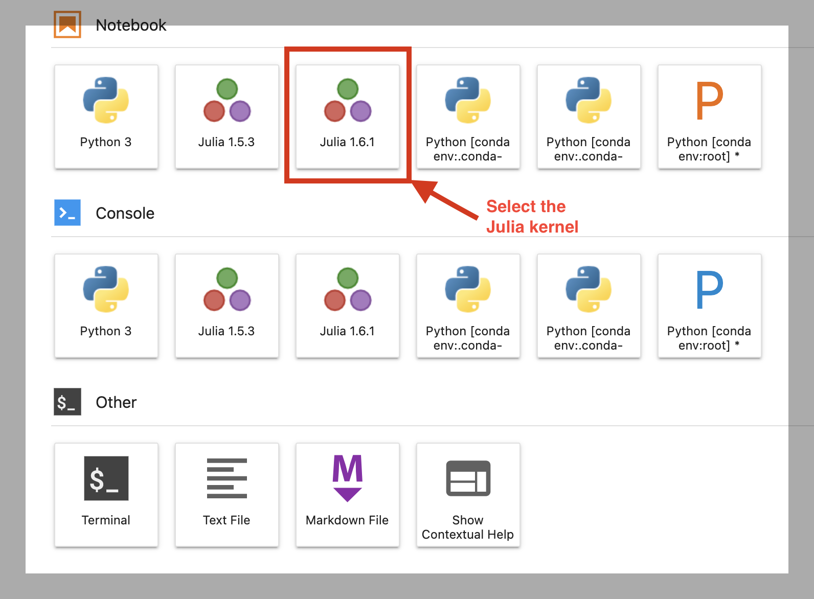

## Julia with Jupyter notebook on the cluster

These instructions are intended to help you set up a [Julia
kernel](https://github.com/JuliaLang/IJulia.jl) to be used with
[Jupyter notebooks](https://jupyter.readthedocs.io/en/latest/) on the
cluster.

### Contents:
* `Montepi-Julia.ipynb`: Notebook with Julia source code

### Setup the necessary Julia packages:

The installation of Julia packages could take significant time and
therefore we recommend that the Julia packages setup is done on a
compute node via an interactive session.

#### Launch an interactive session:

Interactive session on the FAS cluster are initiated with the
<code>salloc</code> command as illustrated below:

```bash
[jharvard@holylogin01 ~]$ salloc -pty -p test --mem=4G -t 120
salloc: Pending job allocation 31172193
salloc: job 31172193 queued and waiting for resources
salloc: job 31172193 has been allocated resources
salloc: Granted job allocation 31172193
salloc: Waiting for resource configuration
salloc: Nodes holy7c26601 are ready for job
[jharvard@holy7c26601 ~]$
```
After your interactive session has started, you need to load the the
Python module. Please refer to the [RC user
portal](https://portal.rc.fas.harvard.edu/p3/build-reports/) for
searching software modules.

```bash
[user@holy7c26601 ~]$ module load python/3.12.5-fasrc01
```
Now start Julia and install the
[IJulia](https://github.com/JuliaLang/IJulia.jl) package, which binds
the Julia kernel with Jupyter. If desired, one can bring the [Julia
package
prompt](https://github.com/JuliaPy/Conda.jl?tab=readme-ov-file) `pkg>`
by typing `]` instead of `using Pkg`.

```julia
julia> ]
(@v1.10) pkg> add IJulia
(@v1.10) pkg> build IJulia
```
Alternatively, one can execute `using Pkg` command to install `IJulia` as follows:
```julia
julia> using Pkg
julia> Pkg.add("IJulia")
julia> Pkg.build("IJulia")
```

### Using the Julia kernel in Jupyter:

To learn how to schedule a Jupyter notebook or Jupyter Lab session via
our [interactive computing portal
(VDI)](https://vdi.rc.fas.harvard.edu/) follow [these
instructions](https://docs.rc.fas.harvard.edu/kb/vdi-apps/#Jupyter_Notebook).

From the the <code>Interactive Apps</code> dropdown menu in the VDI
portal select the <code>Jupyter notebook / Jupyterlab</code>
app. Choose the parameters of your Jupyter job and launch the
interactive session. Once the Jupyterlab interface opens, the
available kernels will be displayed.



> **NOTE:** The available Notebook kernels may differ in your
    environment depending on the actual <code>conda</code>
    environments and Julia versions installed in your user space. When
    you select the desired Julia kernel, the Julia notebook will open
    in a new tab in your browser.


