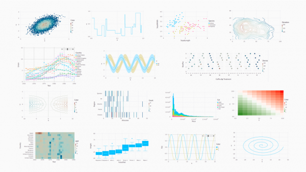

## Julia

[Julia](https://en.wikipedia.org/wiki/Julia_(programming_language)) is a high-level, high-performance dynamic programming language for technical computing. It has syntax that is familiar to users of many other technical computing environments. Designed at MIT to tackle large-scale partial-differential equation simulation and distributed linear algebra, Julia features a robust ecosystem of tools for
[optimization,](https://www.juliaopt.org/)
[statistics,](https://juliastats.github.io/)
[parallel programming,](https://julia.mit.edu/#parallel) and 
[data visualization.](https://juliaplots.github.io/)
Julia is actively developed by teams
[at MIT](https://julia.mit.edu/) and 
[in industry,](https://juliacomputing.com/) along with 
[hundreds of domain-expert scientists and programmers from around the world](https://github.com/JuliaLang/julia/graphs/contributors).

To get started with Julia on Odyssey you can try the below examples:

* [Example 1](Example1): Monte-Carlo calculation of PI
* [Example 2](Example2): Ordinary Differential Equations (ODEs)

You can also try out Julia in a web browser with [JuliaBox.](https://juliabox.com/)

#### References:

* [The Julia Programming Language](https://julialang.org/)
* [Julia Computing](https://juliacomputing.com/)
* [Julia Documentation](https://docs.julialang.org/en/v1/)

